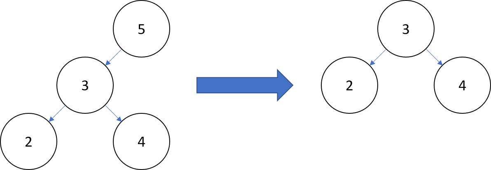
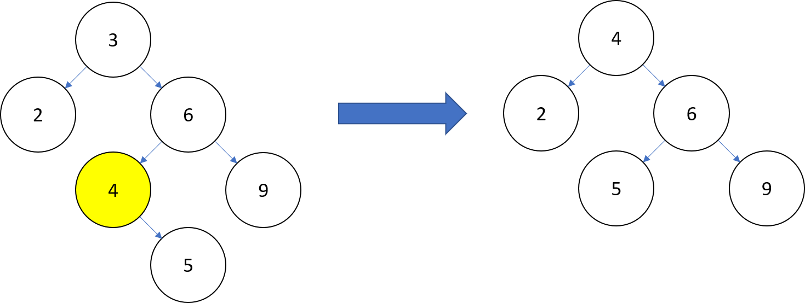

# AAD - Gestionnaire d'arbre binaire de recherche - Aymeric LAISSUS

Pour ce premier TP j'ai décidé de me pencher sur le fonctionnement et la gestion d'arbres binaires de recherche. J'ai choisi le langage *scheme* car il est très adapté à la récursivité, aspect important des arbres binaires de recherche (ABR).

## Arbre binaire de recherche

Tout d'abord penchons-nous sur les ABR.
Un arbre binaire de recherche est un arbre binaire dans lequel chaque nœud possède une clé, telle que chaque nœud du sous-arbre gauche ait une clé inférieure ou égale à celle du nœud considéré, et que chaque nœud du sous-arbre droit possède une clé supérieure ou égale à celle-ci — selon la mise en œuvre de l'ABR, on pourra interdire ou non des clés de valeur égale. Les nœuds que l'on ajoute deviennent des feuilles de l'arbre.

Les arbres binaires de recherche sont très utilisés dans des applications de recherches où la data est très changeante (valeurs qui entrent et sortent très régulièrement)

## Algorithmes (gestion et application console)

Pour créer ce gestionnaire d'ABR j'ai dû créer une multitude de fonctions:

### Constructeurs
- Création d'un ABR vide

```scheme
; Créé un arbre binaire de recherche ABR vide
(define abr-creer-vide
  (lambda ()
    '()))
```

- Construction d'un ABR à partir d'une valeur de noeud, et de 2 ABR fils

```scheme
;Construit un ABR à partir d'une valeur de noeud, et de 2 ABR fils
(define abr-creer
  (lambda (valeur fils-gauche fils-droit)
    (list valeur fils-gauche fils-droit)))
```

### Fonctions simples
- Getters de valeur, fils gauche, fils droit

```scheme
;Récupère la valeur racine d'un ABR
(define abr-valeur (lambda (ABR) (car ABR)))

;Retourne le fils gauche d'un noeud d'ABR
(define abr-fils-gauche (lambda (ABR) (cadr ABR)))

;Retourne le fils droit d'un noeud d'ABR
(define abr-fils-droit (lambda (ABR) (caddr ABR)))
```

- Test d'arbre vide

```scheme
;Teste si un ABR est vide ou non
(define abr-vide? (lambda (ABR) (null? ABR)))
```

- Test pour vérifier si un ABR est une feuille

```scheme
;Teste si l'ABR est une feuille (n'a pas de fils)
(define abr-estfeuille?
  (lambda (ABR)
    (and (abr-vide? (abr-fils-gauche ABR))
         (abr-vide? (abr-fils-droit ABR)))))
```

- Récupérateur du fils le plus à gauche d'un ABR (la plus petite valeur)

```scheme
;Recherche le noeud le plus à gauche de l'ABR
(define abr-fils-plusagauche
  (lambda (ABR)
    (cond
      ((abr-vide? ABR) (abr-creer-vide))
      ((abr-vide? (abr-fils-gauche ABR)) ABR)
      (else (abr-fils-plusagauche (abr-fils-gauche ABR))))))
```


### Fonctions de gestion pure
- Ajout d'un noeud dans un ABR

```scheme
;Ajoute un nouveau noeud dans un ABR
(define abr-ajout
  (lambda (ABR valeur)
    (cond
      ((abr-vide? ABR)           ; si l'abr est vide on créé un nouveau noeud
       (abr-creer valeur (abr-creer-vide) (abr-creer-vide))) 
      ((< valeur (abr-valeur ABR))    ; ajout d'un noeud au fils gauche si la valeur ajoutée est inférieure à la valeur du noeud actuel
       (abr-creer (abr-valeur ABR)
                   (abr-ajout (abr-fils-gauche ABR) valeur)
                   (abr-fils-droit ABR)))
      ((> valeur (abr-valeur ABR))    ; ajout d'un noeud au fils droit si la valeur ajoutée est supérieure à la valeur du noeud actuel
       (abr-creer (abr-valeur ABR)
                   (abr-fils-gauche ABR)
                   (abr-ajout (abr-fils-droit ABR) valeur)))
      (else ABR))))
```

- Suppression de la racine d'un ABR

```scheme
;Supprime la racine de l'ABR donné
(define abr-supp-noeud
  (lambda (ABR)
    (cond
      ; Si la racine n'a aucun fils on retourne un ABR vide
      ((abr-estfeuille? ABR) (abr-creer-vide))
      ; Si la racine a un seul enfant, celui-ci le remplace
      ((abr-vide? (abr-fils-gauche ABR)) (abr-fils-droit ABR))
      ((abr-vide? (abr-fils-droit ABR)) (abr-fils-gauche ABR))
      ; Si la racine a 2 enfants, il est remplacé par l'enfant le plus à gauche de l'enfant de droite
      (else (let* ((nouvelle-racine
                     (abr-valeur (abr-fils-plusagauche (abr-fils-droit ABR))))
                   (nouveau-fils-droit
                     (abr-supp (abr-fils-droit ABR) nouvelle-racine)))
              (abr-creer nouvelle-racine 
                          (abr-fils-gauche ABR) 
                          nouveau-fils-droit))))))
```

- Suppression d'un noeud d'un ABR (s'il existe)

```scheme
;Supprime un noeud s'il existe
(define abr-supp
  (lambda (ABR valeur)
    (cond
      ((abr-vide? ABR) (abr-creer-vide)) ;Si l'ABR est vide on retourne un arbre vide
      ((= valeur (abr-valeur ABR)) (abr-supp-noeud ABR)) ;Si on a trouvé la valeur à supprimer on lui applique abr-supp-noeud
      ((< valeur (abr-valeur ABR)) ;Si la valeur à supprimer est inférieure à la valeur actuelle, on reconstruit un arbre en remplaçant le fils de gauche par une copie de celui-ci sans l'élément à supprimer
       (abr-creer (abr-valeur ABR)
                   (abr-supp (abr-fils-gauche ABR) valeur)
                   (abr-fils-droit ABR)))
      (else ;Si la valeur à supprimer est supérieure à la valeur actuelle, on reconstruit un arbre en remplaçant le fils de droit par une copie de celui-ci sans l'élément à supprimer
        (abr-creer (abr-valeur ABR)
                    (abr-fils-gauche ABR)
                    (abr-supp (abr-fils-droit ABR) valeur))))))
```

### Fonctions d'utilisation
- Recherche d'une valeur dans un ABR

```scheme
;Vérifie si une valeur est présente dans un ABR
(define abr-membre? 
  (lambda (ABR valeur)
    (cond
      ((abr-vide? ABR) #f)
      ((= valeur (abr-valeur ABR)) #t)
      ((< valeur (abr-valeur ABR)) (abr-membre? (abr-fils-gauche ABR) valeur))
      (else (abr-membre? (abr-fils-droit ABR) valeur)))))
```

- Parcours ordonné d'un ABR (parcours infixe)

```scheme
;Retourne une liste triée des valeurs présentes dans l'ABR
(define abr-parcours-ordonne
  (lambda (ABR)
    (cond
      ((abr-vide? ABR) '())
      (else (append
              (abr-parcours-ordonne (abr-fils-gauche ABR))
              (list (abr-valeur ABR))
              (abr-parcours-ordonne (abr-fils-droit ABR)))))))
```

- Calcul de la taille d'un ABR

```scheme
;Compte le nombre de valeurs dans l'ABR
(define abr-taille
  (lambda (ABR)
    (cond
      ((abr-vide? ABR) 0)
      (else (+ 1
               (abr-taille (abr-fils-gauche ABR))
               (abr-taille (abr-fils-droit ABR)))))))
```

### Fonctions dédiées au gestionnaire
- Affichage du menu

```scheme
;Display le menu dans l'interface de commande
(define (menu)
  (display "Menu\n1. Ajout noeud\n2. Supprimer noeud\n3. Recherche noeud\n4. Parcours ordonné\n5. Taille arbre\n6. Afficher arbre\n7. Réinitialiser arbre\n8. Sortir programme\n"))
```

- Lecture d'une commande

```scheme
;Vérifie que le numéro de commande donné par l'utilisateur existe, si ce n'est pas le cas redemande à l'utilisateur de rentrer un numéro
(define (read-command)
(display "Enter choice [1-8] >")
(let* ((in (read-line))
        (n (string->number in)))
(cond ((<= 1 n 8) n)
        (else
        (display "Invalid choice \"")
        (display in)
        (display "\"\n")
        (read-command)))))
```

- Controller principal qui va appliquer les fonctions à l'ABR

```scheme
;Controller principal, exécute les différentes commandes de l'utilisateur
(define (driver ABR)
  (menu)
  (let ((choice (read-command)))
    (cond ((= choice 1) (display "Entrer la valeur à ajouter >")
                        (driver (abr-ajout ABR (string->number (read-line)))))
          ((= choice 2) (display "Entrer la valeur à supprimer >")
                        (driver (abr-supp ABR (string->number(read-line)))))
          ((= choice 3) (display "Entrer la valeur à rechercher >")
                        (display (abr-membre? ABR (string->number(read-line))))
                        (display "\n")
                        (driver ABR))
          ((= choice 4) (display "parcours ordonné:\n\n")
                        (display (abr-parcours-ordonne ABR))
                        (display "\n")
                        (driver ABR))
          ((= choice 5) (display "Taille de l'arbre:\n\n")
                        (display (abr-taille ABR))
                        (display "\n")
                        (driver ABR))
          ((= choice 6) (display "Affichage de l'arbre\n\n")
                        (display ABR)
                        (display "\n")
                        (driver ABR))
          ((= choice 7) (display "Arbre vidé\n")
                        (driver (abr-creer-vide)))
          (else (display "Fin du programme")))))
```

## Explication d'un algorithme : suppression de la racine d'un ABR

Ici je vais prendre le temps de détailler le fonctionnement de l'algorithme le plus intéressant au niveau conceptuel selon moi : La suppression de la racine d'un ABR.
Lorsque l'on veut supprimer la racine d'un abr 3 possiblités s'offrent à nous:

- 1er cas : L'abr n'a pas de fils

Dans ce cas il suffit de renvoyer un abr vide.

- 2eme cas : L'abr n'a qu'un fils

Dans ce cas on remplace par l'ABR fils existant



- 3eme cas : L'abr possède 2 fils

Dans ce cas on va chercher la plus petite valeur du fils de droite, c'est à dire la plus petite valeur supérieure à la valeur que l'on supprime (dans l'exemple la plus petite valeur au dessus de 3 est 4)



## Clarté et compréhension du code

Afin de rendre ce code le plus compréhensible j'ai commenté un maximum les fonctions assez complexes. J'ai également ajouté une description de ce que fait chaque fonction au dessus de ces dernières. 

J'ai profité du fait que le langage scheme possède 2 méthodes de déclaration de fonctions (Indiana et MIT), afin de séparer les 2 *packages* de fonctions:
- Fonctions de gestion des ABR > style Indiana
- Fonctions relatives à l'interface utilisateur > style MIT

## Améliorations après remarques de Clément GUILBERT

Pour permettre à Clément d'effectuer des tests j'ai créé une nouvelle fonction *abr-egalite?* qui vérifie si 2 ABR sont égaux

```scheme
;Vérifie que 2 ABR sont égaux
(define abr-egalite?
  (lambda (ABR ABR2)
  (cond ((and (abr-vide? ABR) (abr-vide? ABR2)) #t)
        ((and (abr-vide? ABR) (not (abr-vide? ABR2))) #f)
        ((and (abr-vide? ABR2) (not (abr-vide? ABR))) #f)
        (else 
          (and (abr-egalite? (abr-fils-gauche ABR) (abr-fils-gauche ABR2))
               (= (abr-valeur ABR) (abr-valeur ABR2))
               (abr-egalite? (abr-fils-droit ABR) (abr-fils-droit ABR2)))))))
```

Clément a surtout remarqué que mon interface permettait à l'utilisateur de provoquer des erreurs, en donnant des valeurs impossibles (booléens, caractères...)

Ces erreurs concernaient les fonctions *driver*, et *read-command*

- Pour *driver* qui était concerné dans les cases 1,2 et 3 j'ai créé une nouvelle fonction *read-value* qui permet de vérifier l'entrée utilisateur pour l'ajout et la suppression (case 1 et 2)

```scheme
;vérifie que la valeur donnée par l'utilisateur est un entier
(define (read-value ABR fct)
  (let* ((in (read-line))
        (n (string->number in)))
(cond ((integer? n) (driver (fct ABR n)))
        (else
        (display "Valeur impossible \"")
        (display in)
        (display "\"\n")
        (driver ABR)))))
```

J'ai également dû modifier le case 3 en ajoutant la vérification directement dans le case (son fonctionnement étant différet des 2 premiers cases)

```scheme
((= choice 3) (display "Entrer la valeur à rechercher >")
                        (let* ((in (read-line))
                                (n (string->number in)))
                              (cond ((integer? n) ;teste si la valeur est entière
                                      (display (abr-membre? ABR (string->number(read-line)))))
                                    (else
                                      (display "Valeur impossible \"")
                                      (display in)
                                      (display "\"\n"))))
                        (display "\n")
                        (driver ABR))
```

- Pour *read-command* j'ai utilisé une astuce qui consiste à remplacer n par -1 (un choix impossible) si n n'est pas un entier. Cela permet d'écrire "choix invalide" si la valeur entrée n'est pas un entier

```scheme
(cond ((<= 1 (if (integer? n) n -1) 8) n)
```

Finalement j'ai pris le temps de passer tous les textes de mon programme en français afin de garder une cohérence globale.